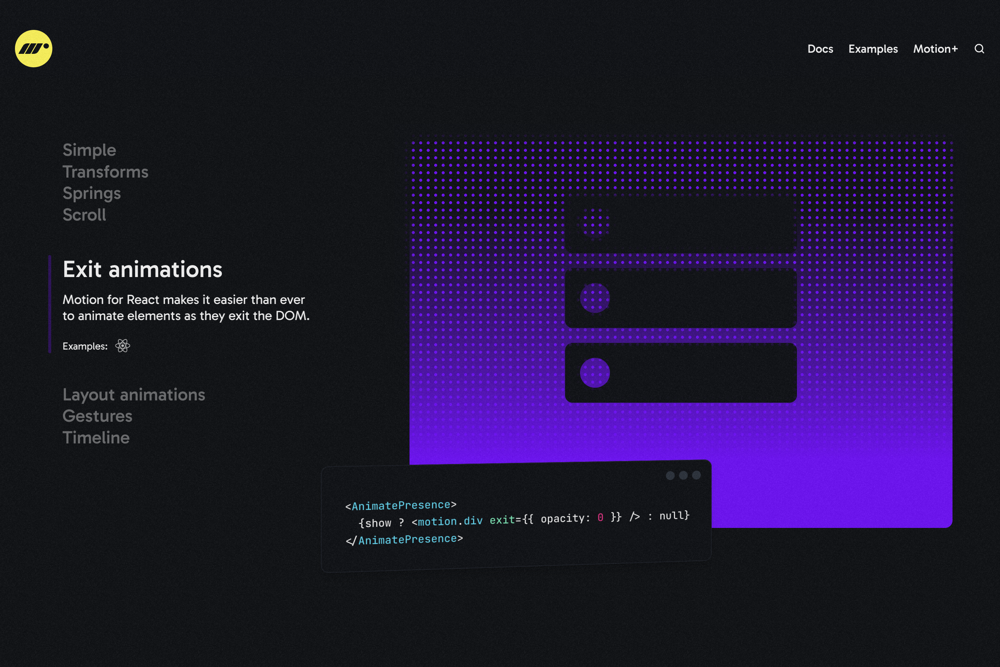

## Introduction

어느 날 디자이너에게 모달을 띄울 때와 닫을 때 자연스럽게 애니메이션 효과를 넣어달라는 요구사항이 들어옵니다. 기존 모달 코드를 보니 상태에 따른 애니메이션 효과를 주는 스타일 클래스가 없었습니다.

```tsx
const Modal = ({ isOpen, onClose, children }: ModalProps) => {
  if (!isOpen) {
    return null;
  }

  return (
    <div className={'modal-overlay'}>
      <div className={'modal-content'}>
        <CloseButton onClick={onClose} />
        {children}
      </div>
    </div>
  );
};
```

요구사항에 따라 CSS Animation을 추가한 클래스를 만듭니다.

```css
/* 페이드인 & 줌인 애니메이션 */
.modal-overlay.modal-show {
  animation: fadeIn 0.3s forwards;
}

.modal-content.modal-show {
  animation: zoomIn 0.3s forwards;
}

/* 페이드아웃 & 줌아웃 애니메이션 */
.modal-overlay.modal-hide {
  animation: fadeOut 0.3s forwards;
}

.modal-content.modal-hide {
  animation: zoomOut 0.3s forwards;
}
```

다음으로 상태에 따라 `className`을 업데이트하여 애니메이션을 추가합니다.

```tsx
export const Modal = ({ isOpen, onClose, children }: ModalProps) => {
  if (!isOpen) {
    return null;
  }

  return (
    <div className={cn('modal-overlay', isOpen ? 'modal-show' : 'modal-hide')}>
      <div className={cn('modal-content', isOpen ? 'modal-show' : 'modal-hide')}>
        <CloseButton onClick={onClose} />
        {children}
      </div>
    </div>
  );
};
```

그리고 다시 모달을 열고 닫아봅니다. 엥? 모달을 띄울 때는 애니메이션이 잘 작동하는데, 모달을 닫을 때는 갑자기 사라져 버립니다. 닫을 때에 `modal-hide` 클래스를 추가했는데도 말이죠. 이런 저런 시도를 봐도 exit 애니메이션은 동작하지 않습니다.

결국 컴포넌트를 unmount하지 않고 CSS 트릭(`visibility` 속성 사용, `opacity`를 0으로 변경 등)을 통해 화면에서만 제거하는 방법이나, `setTimeout`을 CSS 애니메이션 시간과 맞추어 사용하기도 합니다. 하지만 이런 방법들은 다음과 같은 문제점이 존재합니다.

- CSS 트릭을 통해 화면에서만 제거할 경우
  - 컴포넌트 내부의 상태가 초기화 되지 않음
  - 스크린 리더 등을 사용하는 사용자 등 다양한 유저 케이스에 따른 처리가 필요
- CSS 애니메이션 시간과 맞추어 `setTimeout` 사용
  - CSS 애니메이션 시간에 따라 코드도 수정 필요(CSS 변수 사용 등으로 해결할 수 있지만 아래 내용의 문제 발생)
  - 액션이 취소되거나 중단된 경우를 처리하기 어려움
  - 브라우저 성능상의 이유로 애니메이션 지연시, 애니메이션 타이밍 차이로 인한 문제 발생 가능

이런 상황은 아마 React를 사용하는 개발자라면 한번쯤은 겪어봤을 문제일 것이라고 생각합니다. React에서 CSS Animation을 사용할 때, 컴포넌트 mount 시에 애니메이션을 주는 건 어렵지 않지만, unmount시 애니메이션을 주기는 어렵습니다. 왜 이런 문제가 발생할까요?

## React 렌더링 과정과 Exit 애니메이션 충돌

React의 렌더링 과정에 대해서 이해하면 원인을 알 수 있습니다. 모달을 닫을 때, React는 다음과 같이 동작합니다.

1. `IsOpen`을 `false`로 설정
2. 부모 컴포넌트 상태 업데이트에 의한 재렌더링(React Render)
   - 상태 변화에 따라 가상 DOM 내부에 Modal 컴포넌트 미포함
3. React가 Modal 컴포넌트를 DOM에서 언마운트(React Commit)

문제는 이러한 과정에서 React는 상태 업데이트에 따라서 컴포넌트의 마운트 여부를 결정합니다. 하지만 CSS keyframe 애니메이션은 이와 별개로 DOM에 마운트되거나 class가 추가된 직후에 실행됩니다.

즉, 컴포넌트에 exit 애니메이션을 추가해도 class 추가는 상태 업데이트 이후에 발생하며, 이와 동시에 컴포넌트는 React에 의해 dom에서 unmount 됩니다. 따라서 exit 애니메이션은 발생하지 않습니다.

이 문제를 해결하기 위해서는 **DOM에서 컴포넌트를 unmount하는 시점을 지연시켜야 합니다.** 앞서 말씀드린 방법 중 `setTimeout`을 사용하는 것이 바로 unmount를 지연시키는 방법 입니다. 하지만 애니메이션이 중단되거나 취소된 경우는 어떻게 되나요? 부자연스럽게 사라집니다. 또한, 브라우저가 성능상의 이유로 애니메이션을 지연시키면 타이밍에 차이가 발생해 애니메이션이 정확하게 동작하지 않기도 합니다.

즉, 이런 문제를 해결하기 위해서는 DOM에서 컴포넌트를 unmount하는 시점을 **애니메이션이 끝나는 시점**으로 지연시켜야 합니다. 애니메이션이 끝나는 시점을 어떻게 감지하고 컴포넌트를 unmount할 수 있을까요?

## Presence 컴포넌트

Radix UI, Chakra UI, motion/react 등 라이브러리를 사용하면 컴포넌트의 언마운트와 애니메이션이 모두 잘 동작하는 것을 볼 수 있습니다. 그리고 이 라이브러리들은 공통적으로 컴포넌트 exit 애니메이션을 위해 `Presence`라는 컴포넌트를 사용합니다.

- Radix UI는 내부 구현으로 사용하고 있으며, [npm 패키지](https://www.npmjs.com/package/@radix-ui/react-presence)에서 내부 유틸리티 컴포넌트임을 명시하고 있습니다.
- Chakra UI는 Utility 컴포넌트로 [Presence](https://chakra-ui.com/docs/components/presence)를 제공하고 있습니다.
- 애니메이션 라이브러리 motion에서는 exit 애니메이션을 React에서 사용하고자 할 경우 `AnimatePresence` 컴포넌트를 사용하라고 명시되어 있습니다.

  

이런 오픈 소스 라이브러리의 코드를 살펴보면 **애니메이션이 끝나는 시점**을 감지하여 DOM에서 컴포넌트를 unmount하는 방법을 알 수 있을 것 같습니다. 최근에 웹 프론트엔드에서 가장 많이 사용되고 있는 **shadcn/ui**의 기반이 된다고 볼 수 있는 라이브러리인 Radix UI `Presence` 컴포넌트를 분석하면서 컴포넌트 Unmount를 애니메이션 종료 시점으로 지연시키는 방법에 대해 살펴봅시다.

## Radix UI Presence 컴포넌트

`Presence` 컴포넌트의 코드를 살펴보기 전에 알고 가면 좋은 부분에 대해서 먼저 설명 드리려고 합니다. DOM의 animation 관련 이벤트, `useLayoutEffect`, `useRef`에 대한 내용 입니다.

### CSS Animation 관련 DOM 이벤트

DOM은 생각보다 많은 종류의 이벤트를 가지고 있고, 그 중에는 CSS의 동작과 관련된 이벤트도 존재합니다. 아래 4개의 이벤트는 CSS의 Animation과 관련된 이벤트이며, Radix UI는 이벤트들을 사용해 컴포넌트의 Unmount 시점을 제어합니다.

- `animationstart`: 애니메이션이 시작될 때 발생
- `animationend`: 애니메이션이 완료될 때 발생
- `animationiteration`: 애니메이션이 반복될 때마다 발생
- `animationcancel` 애니메이션이 취소될 때 발생
  > CSS Transition과 관련된 이벤트(`transitionstart`, `transitionend`, `transitioncancel`, `transitionrun`)도 존재합니다.

### **`useLayoutEffect`**
`useLayoutEffect`는 `useEffect`와 유사하지만 실행 시점이 다른 React의 내장 Hook 중 하나입니다. `useLayoutEffect`는 **DOM 업데이트 후 브라우저 페인팅 전에 동기적으로 실행**되며, 일반적인 코드를 작성하는데에 사용할 일이 드물며 DOM 요소의 크기나 위치의 측정이 필요하거나 화면 깜빡임 방지가 필요할 때 주로 사용합니다. (일반적으로 UI 라이브러리에서 사용)

### **`useRef`**
`useRef`는 렌더링이 필요하지 않은 값을 참조할 수 있는 Hook입니다. 주로 DOM에 직접 접근하기 위해서 사용하는 경우가 많습니다. 하지만 `useRef`는 그 외에도 다양한 방법으로 사용할 수 있는데, 컴포넌트의 전체 생명주기 동안 지속되는 `useRef`의 특징을 활용하여 렌더링 사이에 값을 유지하기 위해서 사용하는 방법도 그 중 하나입니다.

위 세가지 내용에 대해서 이해한 후, Radix UI의 `Presence` 컴포넌트의 코드를 살펴보겠습니다.

### Presence 컴포넌트

> `@radix-ui/presence` 패키지의 1.1.3-rc.6버전 코드를 기반으로 작성한 글 입니다.

`Presence` 컴포넌트의 코드는 간단합니다.

```tsx
// @radix-ui/primitives/packages/react/presence/src/presence.tsx
interface PresenceProps {
  children: React.ReactElement | ((props: { present: boolean }) => React.ReactElement);
  present: boolean;
}

const Presence: React.FC<PresenceProps> = (props) => {
  const { present, children } = props;
  const presence = usePresence(present);

  // children이 render prop인 경우 present를 전달하여 함수를 실행하여 children 생성
  const child = (
    typeof children === 'function'
      ? children({ present: presence.isPresent })
      : React.Children.only(children)
  ) as React.ReactElement<{ ref?: React.Ref<HTMLElement> }>;

  // useComposedRef
  // ref가 함수라면 value를 넣어서 호출하고, ref가 유효한 값이라면 value를 할당하는 hook
  // 여러개의 ref를 관리를 돕는 utility hook
  const ref = useComposedRefs(presence.ref, getElementRef(child));

  // render prop 함수를 받을 경우 함수로 렌더링을 위임하기 위한 forceMount 변수
  const forceMount = typeof children === 'function';

  return forceMount || presence.isPresent ? React.cloneElement(child, { ref }) : null;
};
```

- **props**
  - `children`: 자식 컴포넌트 혹은 render prop function
  - `present`: 자식 컴포넌트의 현재 마운트 상태
- **return**
  - 조건에 따른 컴포넌트

먼저 return을 살펴보면 `usePresence`의 `isPresent` 값을 기반으로 조건에 따라 컴포넌트를 return 하고 있는 것을 확인할 수 있습니다. `present`값을 기반으로 컴포넌트의 마운트를 제어하면서 exit 애니메이션 종료 시점으로 unmount를 지연시키는 컴포넌트의 동작과 return 값을 기반으로 생각해보면, `isPresent`의 값은 present의 값을 기반으로 하면서 애니메이션이 완료될 때 falsy value로 변경되는 값임을 유추할 수 있습니다.

또한, `children`이 함수인 경우 `forceMount`로 처리하며 children에 `isPresent`의 값을 넘겨주고 있으므로

1. 자식 컴포넌트를 받아서 마운트 상태에 따라 마운트하거나

```tsx
<Presence present={isOpen}>
  <Modal />
</Presence>
```

2. children으로 render props를 넘겨받아 presence 훅의 현재 렌더링 상태를 프로퍼티로 넘겨주어 렌더링을 위임하는

```tsx
<Presence present={isOpen}>{({ present }) => present && <Toast />}</Presence>
```

컴포넌트임을 알 수 있습니다.

컴포넌트를 unmount하는 시점을 지연시키는 방법은 `usePresence`에 나타나 있을 것 같으니 해당 hook 내부의 구현을 확인해봅시다.

#### usePresence

`usePresence` hook의 코드는 조금 복잡해보이지만 순차적으로 분석해봅시다.

```ts
function usePresence(present: boolean) {
  const [node, setNode] = React.useState<HTMLElement>();
  const stylesRef = React.useRef<CSSStyleDeclaration>({} as any);
  const prevPresentRef = React.useRef(present);
  const prevAnimationNameRef = React.useRef<string>('none');
  const initialState = present ? 'mounted' : 'unmounted';
  const [state, send] = useStateMachine(initialState, {
    mounted: {
      UNMOUNT: 'unmounted',
      ANIMATION_OUT: 'unmountSuspended',
    },
    unmountSuspended: {
      MOUNT: 'mounted',
      ANIMATION_END: 'unmounted',
    },
    unmounted: {
      MOUNT: 'mounted',
    },
  });

  // ...

  return {
    isPresent: ['mounted', 'unmountSuspended'].includes(state),
    ref: React.useCallback((node: HTMLElement) => {
      if (node) stylesRef.current = getComputedStyle(node);
      setNode(node);
    }, []),
  };
}
```

`usePresence`는 다음과 같은 값을 가집니다.

- **props**
  - `present`: 부모 컴포넌트에서 전달받은 마운트 상태
- **`state` / `ref`**
  - `node`: DOM 노드를 저장하는 상태
  - `stylesRef`: CSS 스타일
  - `prevPresentRef`: 변경 이전 `present`의 값
  - `prevAnimationNameRef`: 과거 애니메이션 이름
  - `state`: 컴포넌트 내부의 실제 마운트 상태 (애니메이션의 진행 상태)
    - `mounted`: 마운트된 경우 (애니메이션 시작 전)
    - `unmountSuspended`: 언마운트 지연 상태 (애니메이션 진행중)
    - `unmounted`: 언마운트된 경우 (애니메이션 종료 후)
- **return**
  - `isPresent`
    - 컴포넌트가 마운트되었거나 애니메이션이 진행중인 경우 `true`
    - 애니메이션 종료후 `false`
  - `ref`
    - DOM 노드, 스타일을 받아와 `node`, `stylesRef`를 업데이트할 수 있도록 하는 `ref`

return 값을 살펴보면 내부적으로 마운트 상태(애니메이션 진행 상태)를 관리하고, 이를 기반으로 `isPresent`값을 반환하여 컴포넌트 unmount를 지연시키는 것을 알 수 있습니다.

중간에 생략한 부분에 존재하는 `useEffect`와 `useLayoutEffect`를 통해 어떤 방식으로 동작하는지 알 수 있을 것 같네요. 천천히 살펴봅시다.

```ts
React.useEffect(() => {
  const currentAnimationName = getAnimationName(stylesRef.current);
  prevAnimationNameRef.current = state === 'mounted' ? currentAnimationName : 'none';
}, [state]);
```

- `state`(내부 마운트 상태)가 변경되면 `mounted`일 경우 현재 애니메이션 이름을, 아니면 `none`으로 `prevAnimationNameRef`에 할당합니다. 애니메이션 이름을 ref로 설정하여 애니메이션 이름의 변경을 체크하여 unmount 지연 상태를 만듭니다.

```ts
useLayoutEffect(() => {
  const styles = stylesRef.current;
  const wasPresent = prevPresentRef.current;
  const hasPresentChanged = wasPresent !== present;

  if (hasPresentChanged) {
    const prevAnimationName = prevAnimationNameRef.current;
    const currentAnimationName = getAnimationName(styles);

    if (present) {
      send('MOUNT');
    } else if (currentAnimationName === 'none' || styles?.display === 'none') {
      send('UNMOUNT');
    } else {
      const isAnimating = prevAnimationName !== currentAnimationName;

      if (wasPresent && isAnimating) {
        send('ANIMATION_OUT');
      } else {
        send('UNMOUNT');
      }
    }

    prevPresentRef.current = present;
  }
}, [present, send]);
```

- `present`(부모 컴포넌트의 상태) 값이 변경되고, DOM 변경이 화면에 반영되기 전에 현재 애니메이션과 과거의 애니메이션 이름을 가져와 변경이 있었는지 확인합니다.
  - 과거 `present`를 체크해서 상태가 변했는지 체크
  - `present`가 변한 경우,
    - 현재 `present`가 `true`인 경우 (false → true 이므로 Mount 진행)
      - 내부 상태 `mounted`로 업데이트
      - 마운트 될 때는 별다른 처리 없이 animation 정상 동작
    - 현재 `present`가 `false`인 경우 (true -> false 이므로 Unmount 진행)
      - 종료 애니메이션이 없거나(현재 애니메이션 이름이 `none`) 요소가 화면에 나타나지 않는 경우(`display`가 `none`인 경우) - 내부 상태 `unmounted`로 즉시 업데이트 (바로 unmount)
      - 이전 `present`의 값이 `true`면서 애니메이션 이름이 변경된 경우(`present` 상태를 기반으로 animation 이름이 변경되었음) - 내부 상태 `unmountSuspended`로 업데이트(unmount 지연을 통해 애니메이션을 보여줌)
      - 그 외의 경우 - 내부 상태 `unmounted`로 업데이트 (바로 unmount)

```ts
useLayoutEffect(() => {
  if (node) {
    let timeoutId: number;
    const ownerWindow = node.ownerDocument.defaultView ?? window;

    const handleAnimationEnd = (event: AnimationEvent) => {
      const currentAnimationName = getAnimationName(stylesRef.current);
      const isCurrentAnimation = currentAnimationName.includes(event.animationName);
      if (event.target === node && isCurrentAnimation) {
        send('ANIMATION_END');
        if (!prevPresentRef.current) {
          const currentFillMode = node.style.animationFillMode;
          node.style.animationFillMode = 'forwards';
          timeoutId = ownerWindow.setTimeout(() => {
            if (node.style.animationFillMode === 'forwards') {
              node.style.animationFillMode = currentFillMode;
            }
          });
        }
      }
    };

    const handleAnimationStart = (event: AnimationEvent) => {
      if (event.target === node) {
        prevAnimationNameRef.current = getAnimationName(stylesRef.current);
      }
    };

    node.addEventListener('animationstart', handleAnimationStart);
    node.addEventListener('animationcancel', handleAnimationEnd);
    node.addEventListener('animationend', handleAnimationEnd);
    return () => {
      ownerWindow.clearTimeout(timeoutId);
      node.removeEventListener('animationstart', handleAnimationStart);
      node.removeEventListener('animationcancel', handleAnimationEnd);
      node.removeEventListener('animationend', handleAnimationEnd);
    };
  } else {
    send('ANIMATION_END');
  }
}, [node, send]);
```

- node가 변경되는 경우, 애니메이션의 진행 상태를 업데이트하는 아래 이벤트 핸들러를 node에 등록합니다.
  - handleAnimateEnd
    - 현재 활성화된 애니메이션에 대해서만 이벤트 핸들러 실행
    - 애니메이션이 끝나거나 취소되었을 때, `state`를 `unmounted`로 업데이트
    - React 18 동시성으로 애니메이션이 끝나고 화면이 깜빡거리게 됩니다. 이를 방지하기 위해 `animation-fill-mode`를 `forwards`로 처리하여 노드가 마지막 키프레임의 스타일을 유지하도록 하여 플래시를 제거합니다.
  - `handleAnimateStart`
    - 애니메이션이 시작할 때 이전 애니메이션 이름을 현재 애니메이션 이름으로 업데이트

> 이 때, `useEffect`와 `animationstart`가 동일한 동작을 하는데, 이는 React의 렌더링 사이클과 실제 브라우저의 렌더링 타이밍을 둘다 고려하여 동작의 신뢰성을 확보하기 위함입니다. 이 둘을 함께 사용함으로써 React의 가상 DOM 상태와 실제 브라우저 렌더링 사이의 차이에도 안정적인 동작을 보장합니다.

위의 `useEffect`와 `useLayoutEffect`를 기반으로 컴포넌트 마운트시에는 애니메이션이 정상동작하므로 별다른 처리를 하지 않았고, 컴포넌트 언마운트 시에는 애니메이션 이름의 변경을 기반으로 언마운트를 지연시키고 애니메이션 종료시 언마운트하도록 처리한 것을 알 수 있습니다. 그럼 실제로는 어떻게 동작하는지 살펴봅시다.

## Presence 컴포넌트를 사용한 모달 애니메이션 처리 플로우

`Presence` 컴포넌트가 모달 컴포넌트와 함께 작동하는 과정을 단계별로 살펴보겠습니다.

```tsx
// Modal.tsx
export const Modal = ({ isOpen, onClose, children } : ModalProps) => {
  return (
    {/* modal-show: fadeIn keyframe / modal-hide: fadeOut keyframe */}
    <div className={cn('modal-overlay', isOpen ? 'modal-show' : 'modal-hide')}>
      <div className={cn('modal-content', isOpen ? 'modal-show' : 'modal-hide')}>
        <CloseButton onClick={onClose} />
        {children}
      </div>
    </div>
  );
};

// 사용시
const App = () => {
  const [isOpen, setIsOpen] = useState(false);
  return (
    <>
	  <button onClick={() => setIsOpen(true)}>모달 열기</button>
      <Presence present={isOpen}>
        <Modal isOpen={isOpen} onClose={() => setIsOpen(false)} />
      </Presence>
    </>
  )
};
```

### 최초 렌더링시 (`isOpen`: `false`)

1. `usePresence`
   - `present` 값: `false`
   - `state` 초기 상태 `'unmounted'`
   - `isPresent` 값(`false`)과 ref 콜백 반환
2. `Presence`
   - `isPresent`가 `false`이므로 컴포넌트는 `null`을 반환하고, React가 DOM 요소를 생성하지 않음
   - ref 콜백과 이벤트리스너 모두 동작하지 않음

### 모달 열기 (`isOpen`: `false` → `true`)

1. `usePresence` - 첫번째 `useLayoutEffect` 실행 (`present` 값이 변경되었음을 감지)
   - `MOUNT` 이벤트 전송(상태: `unmounted`→ `mounted`)
   - `isPresent` 값: `true`
2. 모달(자식 요소) 렌더링
   - React가 DOM 요소 생성
3. ref 콜백 실행
   - 노드가 DOM에 추가되면 ref 콜백 함수 실행
   - `stylesRef.current`에 컴퓨티드 스타일 저장
   - `setNode`를 호출하여 node 상태 업데이트
4. `usePresence` - 두번째 `useLayoutEffect` 실행 (`node` 값이 변경되었음을 감지)
   - 애니메이션 이벤트 리스너 추가
5. 브라우저 페인팅
   - 모달 요소 화면 표시
   - `fadeIn` 애니메이션 실행
6. `usePresence` - `useEffect` 실행 (`state` 값이 변경되었음을 감지)
   - `prevAnimationNameRef`에 현재 애니메이션 이름(`fadeIn`) 저장
7. 애니메이션 종료
   - 이미 `state`가 `mounted`이므로 별다른 액션 X

### 모달 닫기 (`isOpen`: `true` → `false`)

1. `usePresence` - 첫번째 `useLayoutEffect` 실행 (`present` 값이 변경되었음을 감지)
   - 현재 애니메이션 이름(`fadeOut`) 확인
   - CSS 애니메이션 변경 감지(이전 애니메이션 이름(`fadeIn`)과 현재 상태 비교)
   - `ANIMATION_OUT` 이벤트 전송(상태: `mounted`→ `unmountSuspensed`)
   - `isPresent` 값: `true`
2. 모달은 화면에 계속 있음
3. exit 애니메이션(`fadeOut`)이 시작되면 `animationstart` 이벤트가 발생
   - 현재 애니메이션 이름(`fadeOut`) `prevAnimationNameRef`에 저장
4. exit 애니메이션(`fadeOut`)이 종료되면 `animationend` 이벤트가 발생
   - 현재 애니메이션과 종료된 애니메이션의 이름이 같은 경우에만 실행
   - `ANIMATION_END` 이벤트 전송(상태: `unmountSuspensed`→ `unmounted`)
   - `isPresent` 값: `false`
5. 모달 요소가 DOM에서 제거됨
   - `Presence` 컴포넌트는 모달 컴포넌트를 가상 DOM에 포함시키지 않음
   - 이벤트 리스너 정리 및 관련 상태 초기화
6. `usePresence` - `useEffect` 실행 (`state` 값이 변경되었음을 감지)
   - `prevAnimationNameRef`에 `none` 저장

## React에서 Exit Animation 구현하기

React에서 컴포넌트의 exit 애니메이션을 구현하는 것이 어려운 이유는 React의 렌더링 메커니즘 때문입니다. React는 상태가 변경되면 즉시 컴포넌트를 언마운트하기 때문에, exit 애니메이션이 실행되지 않고 컴포넌트가 DOM에서 제거됩니다.

Radix UI의 `Presence` 컴포넌트는 DOM 요소의 존재 여부와 애니메이션 상태를 기반으로 exit 애니메이션 종료 이후로 컴포넌트의 Unmount를 지연시킵니다. 다음과 같은 방법으로 애니메이션 타이밍을 관리하는 로직을 추상화하여 선언적인 방법으로 exit 애니메이션을 제어합니다.

1. **애니메이션 이벤트 활용**: `animationstart`, `animationend`, `animationcancel` 이벤트를 사용해 애니메이션 상태를 감지합니다.
2. **컴포넌트 내부 상태 기반 언마운트 제어**: 애니메이션이 완료될 때까지 컴포넌트 언마운트를 지연시켜 exit 애니메이션이 완전히 실행될 수 있도록 합니다.

이런 접근 방식은 `setTimeout`이나 CSS 트릭을 사용하는 경우보다 훨씬 안정적입니다. 애니메이션의 실제 완료 시점을 정확히 감지하여 언마운트 타이밍을 제어하므로 브라우저 성능 문제나 애니메이션 지연 등의 상황에서도 자연스럽게 작동합니다.

앞으로는 이런 방식으로 React 애플리케이션에서 Exit 애니메이션을 적용해보시는 것은 어떨까요?
